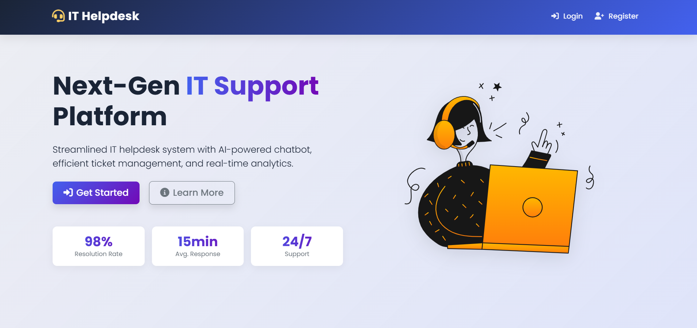
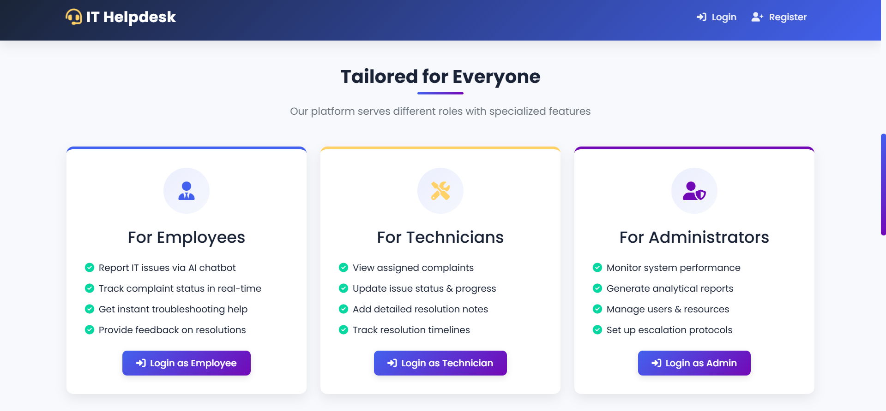
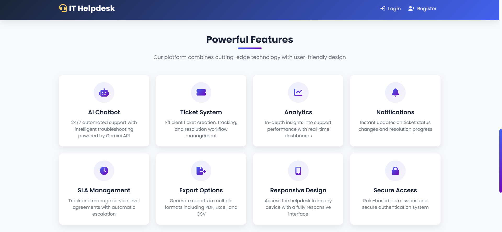

# 🚀 IT Helpdesk System

A modern, AI-powered IT helpdesk system built with Flask, featuring an intelligent chatbot, automated ticket management, and comprehensive analytics.


## Deployed Link
https://it-helpdesk-1-3o8r.onrender.com

## 📸 Screenshots

<div align="center">
  
  
  
</div>

## ✨ Key Features

### 🤖 AI-Powered Chatbot
- Intelligent troubleshooting using Google's Gemini AI
- Automated ticket creation from chat interactions
- Smart response generation for common IT issues
- Fallback mechanisms for offline support

### 🎯 Role-Based Access
- **Administrators**: Full system control and analytics
- **Technicians**: Ticket management and resolution
- **Employees**: Issue reporting and tracking

### 📊 Advanced Analytics
- Real-time dashboard with key metrics
- Performance tracking for technicians
- Resolution time analysis
- Department-wise issue distribution

### 📝 Ticket Management
- Automated ticket generation
- Priority-based assignment
- Status tracking and updates
- Comment system for collaboration
- 6-hour resolution timeline
- Automatic escalation system

### 📧 Communication
- Email notifications for updates
- Automated status alerts
- Resolution confirmations
- Escalation notifications

### 📈 Reporting
- Excel, CSV, and PDF exports
- Customizable report generation
- Historical data analysis
- Performance metrics

## 🛠️ Technical Stack

- **Backend**: Python 3.8+, Flask 2.0.1
- **Database**: SQLite with SQLAlchemy ORM
- **AI Integration**: Google Gemini API
- **Frontend**: HTML5, CSS3, JavaScript
- **Authentication**: Flask-Login
- **Email**: Flask-Mail
- **Data Processing**: Pandas, NumPy
- **Reporting**: ReportLab, OpenPyXL

## 🚀 Getting Started

### Prerequisites
- Python 3.8 or higher
- SQLite3
- Modern web browser
- Google Cloud account (for Gemini API)

### Installation

1. Clone the repository:
```bash
git clone https://github.com/yourusername/it-helpdesk.git
cd it-helpdesk
```

2. Create and activate virtual environment:
```bash
python -m venv venv
# Windows
venv\Scripts\activate
# Linux/Mac
source venv/bin/activate
```

3. Install dependencies:
```bash
pip install -r requirements.txt
```

4. Configure environment variables:
Create a `.env` file with:
```
SECRET_KEY=your-secret-key
MAIL_USERNAME=your-email@gmail.com
MAIL_PASSWORD=your-app-specific-password
FLASK_ENV=development
GEMINI_API_KEY=your-gemini-api-key
```

5. Initialize the database:
```bash
python init_db.py
```

6. Run the application:
```bash
python app.py
```

7. Access the system at `http://localhost:5000`

## 👥 Default Login Credentials

### Administrator
- Username: admin
- Password: admin123
- Email: admin@company.com

### Technician
- Username: tech1
- Password: tech123
- Email: tech1@company.com

### Employee
- Username: emp1
- Password: emp123
- Email: emp1@company.com

## 📚 Documentation

### API Endpoints
- `/api/chat` - AI chatbot interface
- `/api/chat/save` - Save chat history
- `/admin/dashboard/stats` - Analytics data
- `/admin/export/*` - Report generation

### Database Schema
- **User**: User management and authentication
- **Complaint**: Ticket tracking and management
- **Comment**: Communication and updates

## 🔒 Security Features

- Role-based access control
- Password hashing
- Session management
- CSRF protection
- Input validation
- Secure file handling

## 📈 Performance Metrics

- Average resolution time
- Technician efficiency
- Department-wise issue distribution
- Priority-based analysis
- User satisfaction metrics


